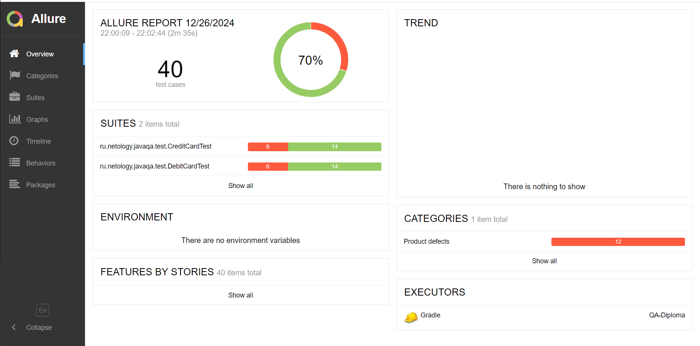
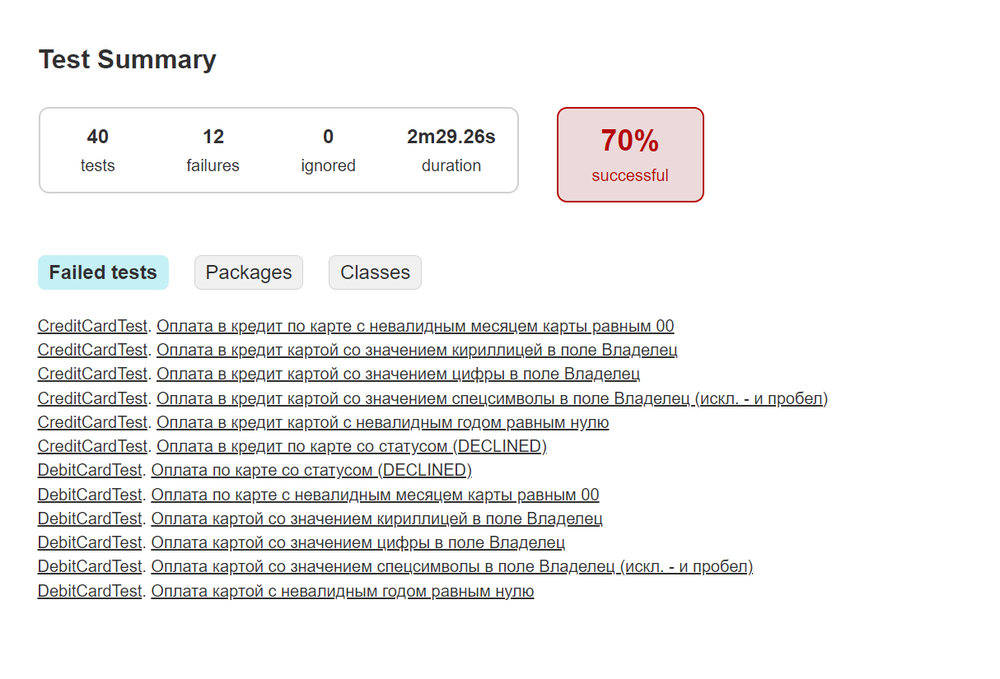
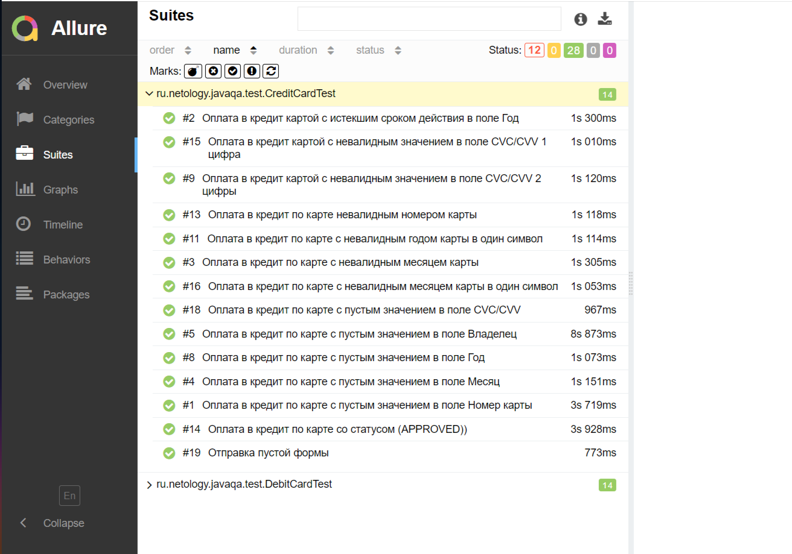
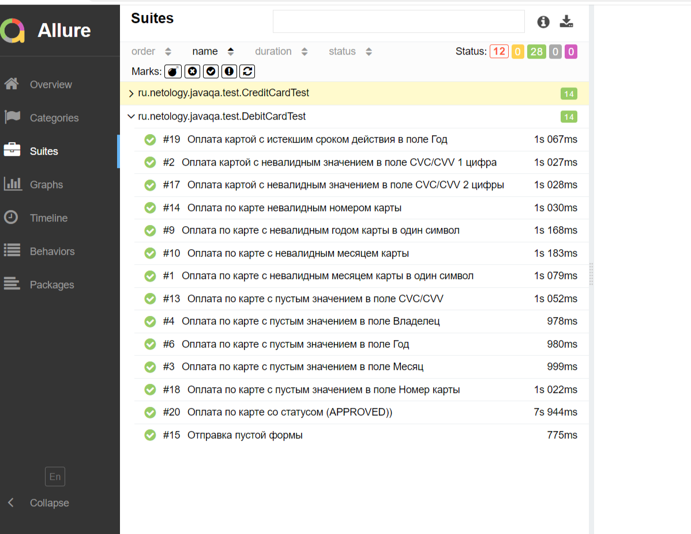
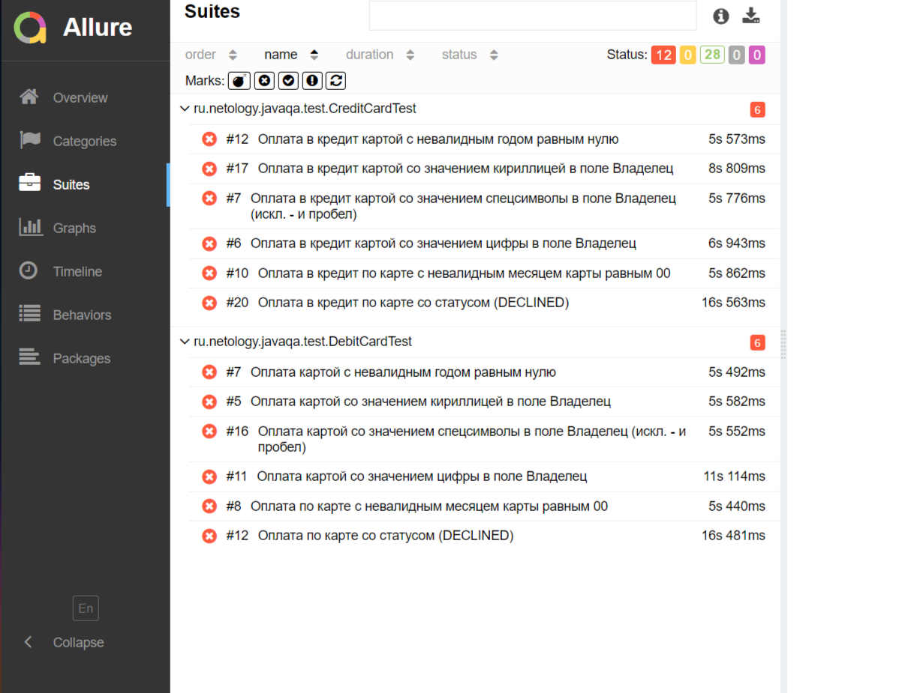

# Отчётные документы по итогам тестирования

## 1. Краткое описание

В соответствии с [планом](https://github.com/NataliaKrasnykh/QA-Diploma/blob/main/documents/Plan.md#план-автоматизации-тестирования-приложения-путешествие-дня) проведено автоматизированное тестирование функционала веб-сервиса **"Путешествие дня"**, взаимодействующего с СУБД и API
Банка.

В ходе тестирования были задействованы сервисы:

###### Payment Gate - сервис платежей;
###### Credit Gate - кредитный сервис.

Тестирование проведено на основе двух СУБД:

###### MySQL;
###### PostgreSQL.

## 2. Количество тест-кейсов

Общее количество проведенных тест-кейсов равно  **40**.
- Оплата по карте - 20 (позитивных - 1, негативных - 19)
- Оплата  в кредит по карте - 20 (позитивных - 1, негативных - 19)

### Успешных тест-кейсов:
* Payment Gate - сервис платежей - 12 тест-кейсов
* Credit Gate - кредитный сервис - 12 тест-кейсов

### Неуспешных тест-кейсов:
* Payment Gate - сервис платежей - 6 тест-кейсов
* Credit Gate - кредитный сервис - 6 тест-кейсов

* 
## 3. Результаты тестов в процентном соотношении
* Успешных тест-кейсов - 70%
* Неуспешных тест-кейсов -30%

## 4. Общие рекомендации
В результате проведения тестирования были выявлены следующие ошибки:
1. Заголовок web-страницы "Заявка на карту" не соответствует названию и функционалу приложения "Путешествие дня"
2. Успешная оплата по карте с невалидным месяцем карты равным 00
3. Успешная оплата в кредит по карте с невалидным месяцем карты равным 00
4. Успешная оплата по карте со значением кириллицей в поле Владелец
5. Успешная оплата в кредит по карте со значением кириллицей в поле Владелец
6. Успешная оплата по карте со значением цифры в поле Владелец
7. Успешная оплата в кредит по карте со значением цифры в поле Владелец
8. Успешная оплата по карте со значением спецсимволы в поле Владелец (искл. - и пробел)
9. Успешная оплата в кредит по карте со значением спецсимволы в поле Владелец (искл. - и пробел)
10. Неверное сообщение об ошибке при оплате в кредит картой с невалидным годом равным нулю
11. Неверное сообщение об ошибке при оплате картой с невалидным годом равным нулю
12. Успешная оплата в кредит по карте со статусом (DECLINED)
13. Успешная оплата по карте со статусом (DECLINED)
14. Опечатка в названии города Марракеш
Подробнее данные ошибки описаны в [Issues](https://github.com/NataliaKrasnykh/QA-Diploma/issues).

* Необходимо устранить данные дефекты.
* Составить подробную документацию для данного приложения
* Добавить уникальные идентификаторы для элементов страниц (test-id) упрощения процесса автоматизации тестирования

